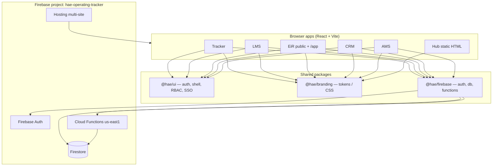
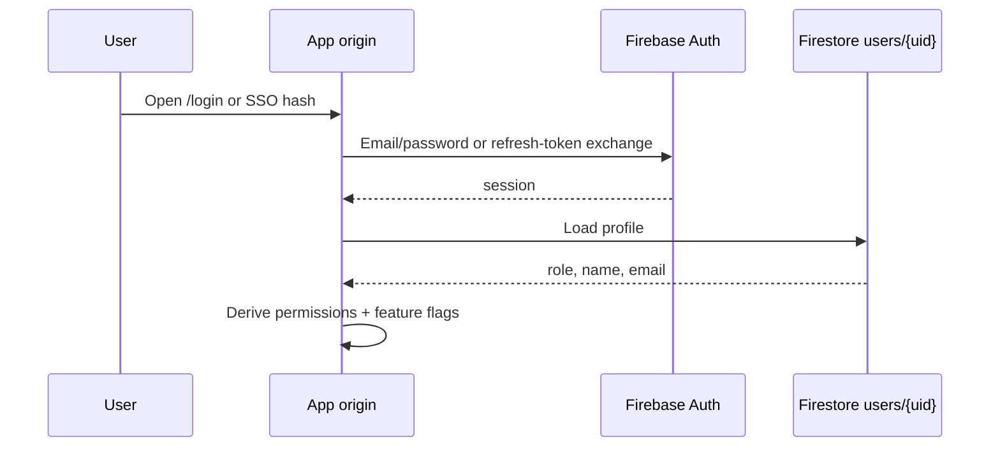
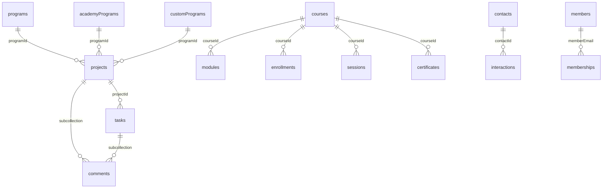

# HAE Platform — System Architecture

Guide for developers joining this monorepo. Read this first, then [`README.md`](./README.md) for commands/URLs and [`AGENTS.md`](./AGENTS.md) / [`CLAUDE.md`](./CLAUDE.md) for agent workflow.

---

## 1. What we are building

Harvard Alumni Entrepreneurs (**HAE**) runs **one platform** across several product modules. All modules share:

- One Firebase project: **`hae-operating-tracker`**
- One Auth directory (`users` + Firebase Auth)
- Shared branding (`@hae/branding`) and UI shell (`@hae/ui`)
- A top **platform header** to switch Hub / Tracker / LMS / EiR / CRM / AMS

| Module | App path | Live URL | Status |
|--------|----------|----------|--------|
| Hub (landing) | `apps/hub` | https://hae.web.app | Live (static) |
| Operations (Tracker) | `apps/operating-tracker` | https://tracker-hae.web.app | Live |
| Learning (LMS) | `apps/lms` | https://lms-hae.web.app | Live |
| Experts (EiR) | `apps/eir` | https://eir-hae.web.app | Live (public + `/app`) |
| Relationships (CRM) | `apps/crm` | https://crm-hae.web.app | Live |
| Membership (AMS) | `apps/ams` | https://ams-hae.web.app | Live |

Public brand site (external): https://www.harvardae.org/

---

## 2. High-level architecture



**Design choice:** Prefer **Spark-safe** defaults — Hosting + Firestore rules always deploy. Cloud Functions need **Blaze** and must never block hosting CI.

---

## 3. Repository layout

```
organization-app/
├── apps/
│   ├── hub/                  # Static landing (hae.web.app)
│   ├── operating-tracker/    # Milestone 1 — programs / projects / tasks
│   ├── lms/                  # Academy LMS
│   ├── eir/                  # Expert Office Hours (public + member app)
│   ├── crm/                  # Contacts & interactions
│   └── ams/                  # Members, memberships, events, Stripe links
├── packages/
│   ├── firebase/             # Shared Auth + Firestore + Functions client
│   ├── branding/             # HAE theme, tokens, hub/header CSS
│   └── ui/                   # Auth, ModuleShell, PlatformHeader, RBAC, help
├── functions/                # Cloud Functions (Blaze) — Executive Inbox, etc.
├── scripts/                  # import-real-data, sync-hub-branding
├── firestore.rules
├── firebase.json
├── .firebaserc
├── SYSTEM_ARCHITECTURE.md    # This document
├── README.md
├── AGENTS.md / CLAUDE.md
└── .github/workflows/        # Deploy on push to main
```

npm **workspaces**: `apps/*`, `packages/*`, `functions`.

---

## 4. Stack

| Layer | Choice |
|-------|--------|
| UI | React 18, React Router 6, Vite 8 |
| Styling | Tailwind v4 via `@hae/branding` (`hae-crimson`, `hae-ink`, `hae-slate`, `font-display`, …) |
| Auth | Firebase Auth email/password |
| Data | Cloud Firestore (client SDK; filter in app unless rules require queries) |
| Backend (optional) | Cloud Functions v2, region `us-east1` |
| Payments (AMS) | Stripe Payment Links (URLs stored in Firestore; no Stripe server SDK required for basic flow) |
| Node | `>=20` locally; CI uses 22 |

---

## 5. Apps and shells

| App | Shell | Notes |
|-----|-------|-------|
| Tracker | Local `Layout` + `@hae/ui` `PlatformHeader` + local `Sidebar` | Programs / Academy / Custom Programs sections |
| LMS, CRM, AMS | `@hae/ui` `ModuleShell` | Pass `navItems` + app-specific routes |
| EiR public | `PublicShell` | **No login** — Home, Directory, Expert profile, How it works |
| EiR members | `ModuleShell` under `/app` | Manage experts (staff) |
| Hub | Static HTML | Branding CSS copied by `npm run sync:hub` |

### Typical app wiring

1. `main.jsx` → `AuthProvider` + `FeaturesProvider` + router
2. Public routes: `/login`, `/auth/action`
3. Protected routes: `ProtectedRoute` + optional `Can` / feature gates
4. Shell renders platform header + left nav for **this app only**

---

## 6. Shared packages

### `@hae/firebase`

- Exports: `auth`, `db`, `functions` (`us-east1`), `secondaryAuth`, `firebaseConfig`
- `secondaryAuth` = second Firebase app so **Admin can create users without signing out**

### `@hae/branding`

- Theme CSS, platform header CSS, hub CSS, JS `brand` tokens
- Do **not** invent a parallel design system

### `@hae/ui`

| Concern | What to use |
|---------|-------------|
| Auth UI | `LoginPage`, `AuthActionPage`, `AuthProvider` / `useAuth` |
| Shell | `ModuleShell`, `PlatformHeader`, `SideNav`, `Modal` |
| Access | `PERMISSIONS`, `ProtectedRoute`, `Can`, roles |
| Features | `FEATURES`, `useFeatures`, `FeaturesGate` |
| Cross-app nav | `MODULES`, `navigateToModule` (SSO handoff) |
| Help | `HelpGuide`, `helpContent.js` |
| Utilities | ICS/CSV helpers, greetings |

**Note:** Tracker still has a local `AuthContext` (same ideas + `refreshProfile`). Prefer `@hae/ui` for new apps; long-term unify Tracker onto the shared provider.

---

## 7. Auth, RBAC, and features

### Auth flow



- Password reset / verify email: custom **`/auth/action`** on every app (avoids empty `apiKey=` on Firebase hosted handler). See README.
- Cross-app SSO: `navigateToModule` puts a refresh token in the URL hash; target app exchanges it. Each origin still has its own Auth persistence.

### Roles (`users.role`)

| Role | Intent |
|------|--------|
| `admin` | Users, import/export, all apps |
| `staff` | Day-to-day ops across Tracker / LMS manage / EiR manage / CRM / AMS |
| `member` | Alumni: EiR, AMS self-service, LMS catalog |
| `student` | Academy: LMS learning + catalog; EiR browse |
| `user` (legacy) | Treated as **staff** in rules + RBAC |

### Permissions (summary)

`tracker:*`, `lms:*`, `eir:*`, `crm:*`, `ams:*`, `platform:users`, `platform:import` — defined in `packages/ui/src/rbac.js`. Always use these helpers; do not scatter ad-hoc role checks.

### Feature flags

- Document: `platformSettings/features`
- Toggled in Tracker → Admin → **Features** (superadmins only)
- Superadmins always see everything

### Superadmins (hard-coded)

- `njcarlo@gmail.com`
- `inahmarchadesch@gmail.com`  
  (also mirrored in `firestore.rules`)

### Executive Inbox allowlist (separate)

- `rmarchadesch@harvardae.org`, `rryan@harvardae.org`
- Gmail/Calendar sync via Cloud Functions — needs Blaze + OAuth secrets

---

## 8. Data model

Firestore is the system of record. Document IDs are often used as stable foreign keys (`programId`, `courseId`, email match for people).



### Tracker

| Collection | Purpose |
|------------|---------|
| `programs` | Default ops programs |
| `academyPrograms` | Academy category (same projects/tasks pattern) |
| `customPrograms` | Custom category |
| `projects` / `tasks` | Shared; filter by `programId` |
| `projects/{id}/comments`, `tasks/{id}/comments` | Comments + @mentions |
| `notifications` | Mention digests |
| `surveys`, `surveyResponses`, `surveyInvites` | Surveys (public respond when Open) |
| `courseRegistrations` | Academy registration tracking UI |
| `users` | Directory + roles |

Dashboard can tab-filter by Programs / Academy / Custom Programs.

### LMS

`courses`, `modules`, `enrollments`, `sessions`, `checkIns`, `certificates`  
Learner email on enrollments/check-ins/certificates must match login email for student views.  
Course tuition / payment fields feed **LMS Dashboard → Earnings & analytics**.

### EiR

`experts` — only **`status == Active`** is publicly listable/readable. Hide email on public UI.

### CRM

`contacts`, `interactions` — optional URL attachments. Person linking matches email → AMS/LMS docs.

### AMS

`members`, `memberships`, `events`, `committees`, `amsSettings/pricing` (tiers + Stripe Payment Link URLs).

### Platform / server-only

| Collection | Access |
|------------|--------|
| `platformSettings` | Features (superadmin write) |
| `execInboxTokens`, `execInboxOAuthState` | **No client access** |
| `execInboxStatus`, `execInboxEmails`, `execInboxMeetings` | Exec allowlist read |

**Rules rule:** Any new collection or public-read change must update `firestore.rules` in the same PR.

---

## 9. Cloud Functions

| Function | Type | Purpose |
|----------|------|---------|
| `execInboxGetOauthUrl` | Callable | Start Google OAuth for Exec Inbox |
| `oauthCallback` | HTTP | Store OAuth tokens |
| `execInboxSyncNow` | Callable | Sync Gmail + Calendar, classify with Anthropic |
| `execInboxSyncScheduled` | Schedule (15m) | Same sync on a timer |
| `onMentionNotificationCreated` | Firestore trigger | Emails @mentioned users (needs `RESEND_API_KEY`) |

Secrets: `GOOGLE_OAUTH_CLIENT_ID`, `GOOGLE_OAUTH_CLIENT_SECRET`, `ANTHROPIC_API_KEY`.  
Mention email env: `RESEND_API_KEY` (optional), `MENTION_EMAIL_FROM` (optional from-address).

Deploy: `npm run deploy:functions` (Blaze). CI attempts functions with **continue-on-error**.

---

## 10. Hosting and CI

### Hosting targets

Primary sites: `hae`, `tracker-hae`, `lms-hae`, `eir-hae`, `crm-hae`, `ams-hae`  
Legacy aliases: `hae-operating-tracker`, `hae-lms`, … (same builds).

SPA apps rewrite `**` → `/index.html`.

### CI (`.github/workflows/deploy-firebase.yml`)

On push to `main` (or manual run):

1. `npm ci`
2. `sync:hub` + `build:all`
3. Deploy **hosting + firestore:rules** (must succeed)
4. Deploy **functions** (best-effort; Spark may fail)

Secret: `FIREBASE_TOKEN` (`firebase login:ci`).

After merge: confirm the Action is green before telling users “it’s live.”

---

## 11. Local development

```bash
npm install

npm run dev:tracker   # http://localhost:5173
npm run dev:lms       # :5174
npm run dev:crm       # :5175
npm run dev:ams       # :5176
npm run dev:eir       # :5177
# Hub static: serve apps/hub (local hub port 5180 in modules.js)

npm run build:all
npm run lint
npm run import:real   # upsert seed programs/projects/tasks/users (needs token)
```

Platform header links switch to localhost ports when developing.

### Git conventions

- Branch from latest `main`
- Cursor agents: `cursor/<descriptive-kebab>-<suffix>`
- Small, focused PRs; update rules/help/README when behavior changes
- Build touched apps before claiming done

---

## 12. Security and ops checklist

1. Add each hosting domain to Firebase Auth **Authorized domains**
2. Point Auth email templates (password reset, etc.) at `https://<site>/auth/action`
3. Create users via Tracker **Admin → Users** (creates Firebase Auth + `users/{uid}`). JSON import alone does **not** create Auth accounts
4. Keep `firestore.rules` aligned with queries (especially public EiR `status == Active`)
5. Never commit CI tokens or OAuth client secrets
6. Do not gate public EiR routes behind login

---

## 13. Where to change what

| Goal | Start here |
|------|------------|
| New page in an existing app | That app’s `App.jsx` + page under `src/pages/` |
| Shared login / header / RBAC | `packages/ui` |
| Theme / colors / fonts | `packages/branding` |
| New Firestore collection | App write path + **`firestore.rules`** |
| Feature toggle | `packages/ui` `features.js` + Admin Features UI |
| Exec Inbox | `functions/*`, Tracker `ExecutiveInbox.jsx` |
| Hub landing copy/CSS | `apps/hub` + `npm run sync:hub` |
| Help text | `packages/ui/src/helpContent.js` |

Skills for agents: `.claude/skills/` (`/ship-pr`, `/add-app-page`, `/firebase-change`).

---

## 14. Tasks backlog

Prioritized work still needed or intentionally deferred. Update this section when items ship.

### P0 — Unblock people / Auth

| Task | Why | Notes |
|------|-----|-------|
| **Bulk put emails into Firebase Auth** | Login + password reset require Auth users; Firestore profiles alone are not enough | Implementation on branch `cursor/provision-auth-emails-23ef` (Admin → Users bulk invite + optional `provisionAuthUsers` function). Needs PR merge + deploy |
| Confirm Auth email templates use `/auth/action` on all sites | Avoids “page mode is invalid” when `apiKey` is empty | README has Console steps |

### P1 — Production ops

| Task | Why | Notes |
|------|-----|-------|
| Upgrade project to **Blaze** (if Exec Inbox / scheduled sync / auto mention email are required) | Functions will not deploy on Spark | CI already isolates functions |
| Finish Executive Inbox secrets + Google Cloud APIs | OAuth + Anthropic | Allowlist ≠ Firebase console owner |
| Set `RESEND_API_KEY` (+ verified from-domain) for automatic @mention email | Without it, mentions stay in-app + optional mailto draft | Function: `onMentionNotificationCreated` |

### P2 — Product gaps

| Task | Why | Notes |
|------|-----|-------|
| **EiR in-app scheduling** | Booking is external `bookingUrl` only | Documented in `apps/eir/README.md` |
| LMS **staff owner / “My courses”** filter | Staff currently see all courses; only free-text `facilitator` | Product decision: add `staffOwner` + filter |
| Revisit Tracker **project fundraising metrics** | Added then removed from Dashboard/Program pages (`64b03ab`) | LMS course earnings analytics remain; decide if Tracker metrics return |
| Custom-token SSO (`ct.`) | Stronger cross-origin handoff | Needs Functions / Blaze |
| Nested `*.hae.web.app` custom domains | Cleaner URLs | Firebase `web.app` site IDs cannot contain dots; custom domain later |

### P3 — Engineering hygiene

| Task | Why | Notes |
|------|-----|-------|
| Unify Tracker `AuthContext` onto `@hae/ui` | One auth implementation | Tracker has a local duplicate |
| Keep `helpContent.js` in sync with UI | Help still may mention Tracker fundraising analytics after removal | Audit Tracker Dashboard help |
| Consider Storage for file uploads | CRM uses URL attachments only (Spark-friendly) | Only if product needs binary uploads |
| Split CRM read vs write UI if needed | Same pages gated for both permissions today | Low priority |

### Done recently (context)

Milestones 1–5 shipped: Tracker, LMS, EiR public directory, CRM, AMS, surveys/notifications/ICS/CRM linking/password reset, category program pages, course registrations, comments/@mentions, dashboard category tabs, LMS earnings analytics. See git history / merged PRs for detail.

---

## 15. Quick “day one” path for a new developer

1. Read this doc + [`README.md`](./README.md)
2. `npm install` → `npm run dev:tracker` (and any other app you own)
3. Sign in with a user that has a Firebase Auth account **and** a `users/{uid}` profile
4. Skim `firestore.rules` and `packages/ui/src/rbac.js`
5. Make a small change behind a feature you understand; open a PR; wait for CI hosting deploy

Questions about product intent: prefer matching neighboring code and HAE crimson/Inter patterns over inventing new architecture.
